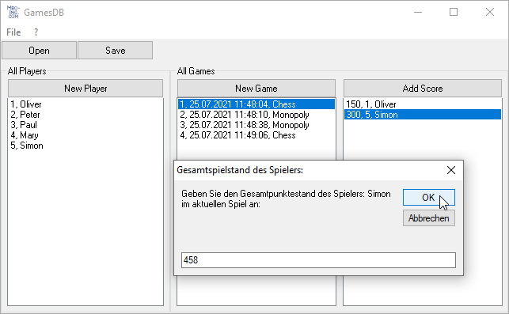

# Game_GamesDB  
## Social, real friends real games-evening manager  

 

This one was my first attempt to OOP-design, project started around 2001.
It is the kind of code focused on simplicity, but it has everything a complete desktop-app needs.

